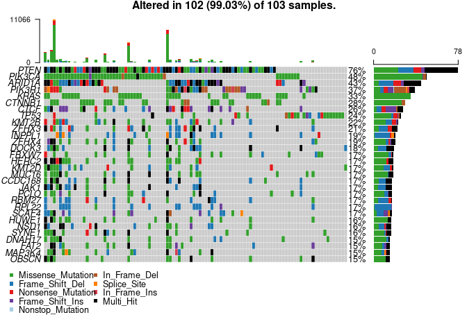
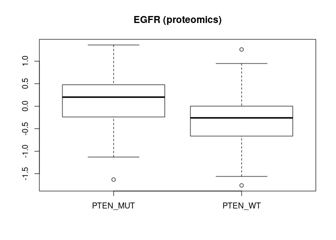
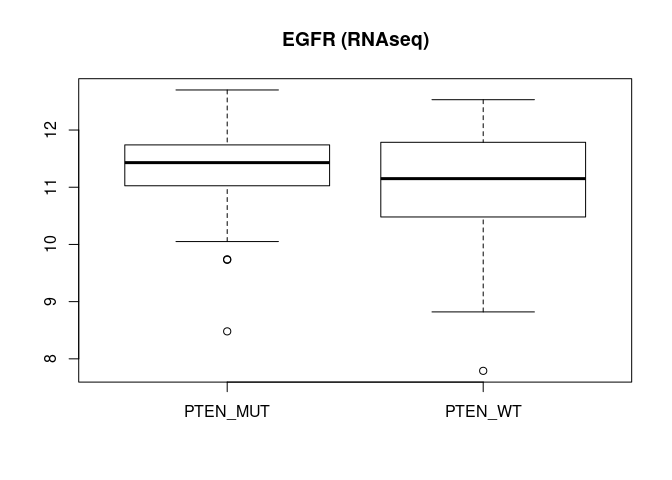

useCase
================

## Get multi omics data of Endometrial

``` r
library(CPTACBiolinks)
CancerType = "Endometrial"
proteomics = getDataType(CancerType,"Proteome")
```

    ## [1] "Loading Proteome"

``` r
RNAseq = getDataType(CancerType,"RNAseq")
```

    ## [1] "Loading RNAseq"

``` r
mutation = getDataType(CancerType,"mutation")
```

    ## [1] "Loading mutation"
    ## -Reading
    ## -Validating
    ## -Summarizing
    ## -Processing clinical data
    ## --Missing clinical data
    ## -Finished in 4.122s elapsed (19.0s cpu)

## Plot Mutation

``` r
plotMutations(mutation$`Mutation (Gene level, Tumor)`)
plotMutations(mutation$`Mutation (Site level, Tumor)`)
```

<!-- --><!-- -->

## Subset RNAseq and Proteomics with shared mutation

``` r
RNAseq_tum = RNAseq$`RNAseq (HiSeq, Gene level, Tumor)`
proteomics_tum = proteomics$`Proteome (Gene level, TMT Unshared Log Ratio, Tumor)`
mutation_tum = mutation$`Mutation (Gene level, Tumor)`

top_gene = topMutatedGenes(mutation_tum, 1)

RNAseq_sub = subsetSharedMutation(RNAseq_tum,mutation_tum,top_gene$geneID)
proteomics_sub = subsetSharedMutation(proteomics_tum,mutation_tum,top_gene$geneID)
```

## Boxplot EGFR RNAseq and Proteomics

``` r
samples_notPTEN <- colnames(proteomics_tum)[!colnames(proteomics_tum) %in% colnames(proteomics_sub)]

boxplot(list(PTEN_MUT = t(proteomics_sub["EGFR",]), PTEN_WT = t(proteomics_tum["EGFR",samples_notPTEN])), main ="EGFR (proteomics)")
```

<!-- -->

``` r
boxplot(list(PTEN_MUT = t(RNAseq_sub["EGFR",]), PTEN_WT = t(RNAseq_tum["EGFR",samples_notPTEN])), main ="EGFR (RNAseq)")
```

<!-- -->
