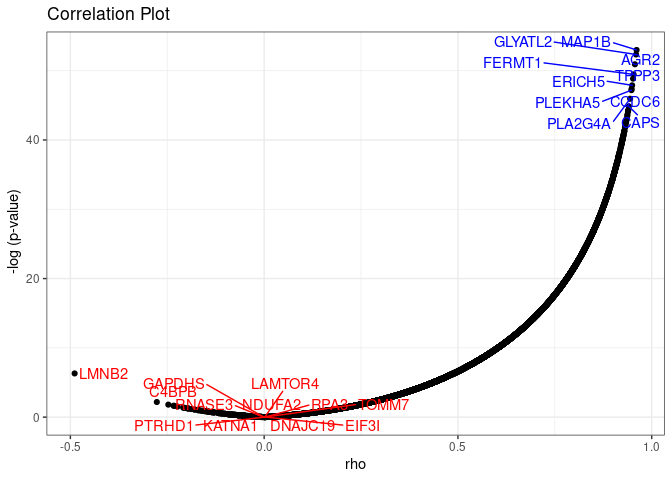
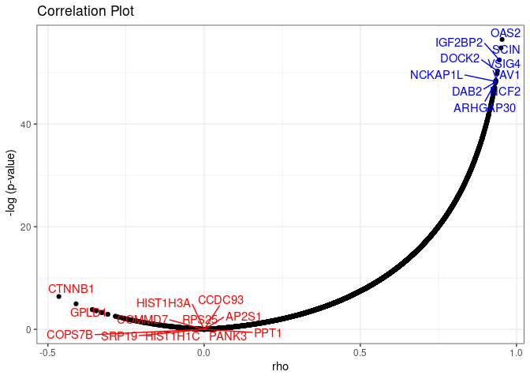

useCase
================

## Get multi omics data of (Endometrial)

``` r
CancerType = "Endometrial"
proteomics = getDataType(CancerType,"Proteome")
```

    ## [1] "Loading Proteome"

``` r
RNAseq = getDataType(CancerType,"RNAseq")
```

    ## [1] "Loading RNAseq"

## RNAseq and Proteomics (Endometrial)

``` r
proteomics_tum = proteomics$`Proteome (Gene level, TMT Unshared Log Ratio, Tumor)`
rnaseq_tum = RNAseq$`RNAseq (HiSeq, Gene level, Tumor)`

correlation_df <- correlationOmics(proteomics_tum,rnaseq_tum)

p1 <- plotCorrelation(correlation_df)
p1 
```

<!-- -->

## RNAseq and Proteomics Correlation (GBM)

``` r
library(CPTACBiolinks)
CancerType = "GBM"
proteomic = getDataType(CancerType,"Proteome")
```

    ## [1] "Loading Proteome"

``` r
RNAseq = getDataType(CancerType,"RNAseq")
```

    ## [1] "Loading RNAseq"

## RNAseq and Proteomics Correlation (GBM)

``` r
proteomics = as.data.frame(proteomic$proteome_normalized)
rnaseq = as.data.frame(RNAseq$RNAseq_fpkm_uq)

keep <- !duplicated(rnaseq$gene_name)
rnaseq <- rnaseq[keep,]
rownames(rnaseq) <- rnaseq$gene_name
rnaseq <- rnaseq[,-c(1:3)]


keep <- !duplicated(proteomics$symbol)
proteomics <- proteomics[keep,]
rownames(proteomics) <- proteomics$symbol
proteomics <- proteomics[,-c(1:3)]

correlation_df <- correlationOmics(proteomics,rnaseq)

p1 <- plotCorrelation(correlation_df)
p1 
```

<!-- -->
